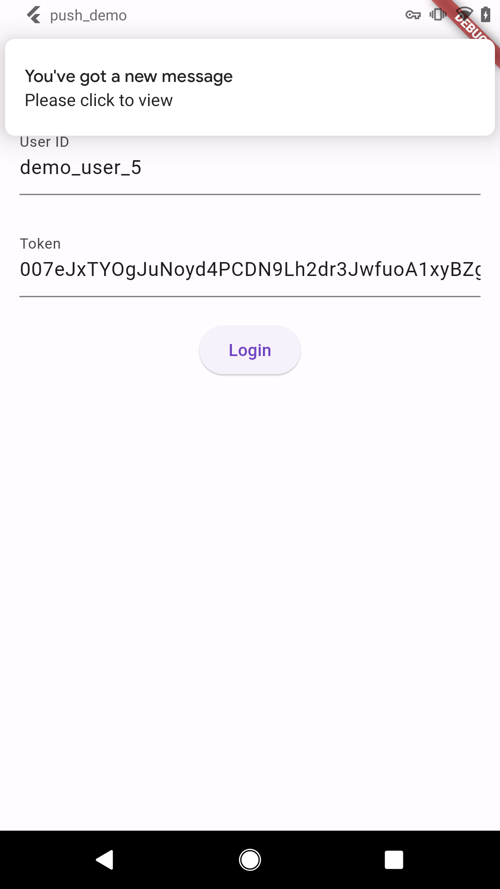
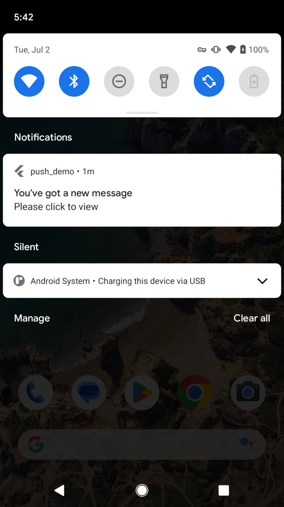
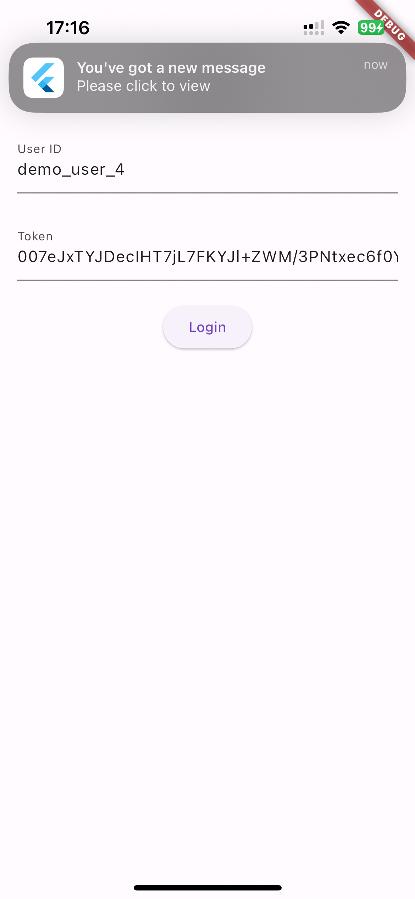

# Agora Chat Push Demo flutter 

| Platform | Foreground Notifications | Background Notifications |
|----------|----------|----------|
| Android |  |   |
| iOS |  |  |

## Requirements

* Flutter 3.16.0 or later
* Dart 3.3.0 or later
* FlutterFire CLI   
  Install the FlutterFire CLI `dart pub global activate flutterfire_cli`

## Getting Started

1. Clone the repository.
2. Navigate to the project directory.
3. Initialize Firebase with `flutterfire configure`.
4. Update `lib/consts.dart` with your Firebase and Agora Chat credentials.
5. Install dependencies with `flutter pub get`.
6. Run the app using `flutter run`.

## Testing if Push Notifications are Setup Correctly
After configuring [agora-chat-cli](https://github.com/ycj3/agora-chat-cli), run the following command using your user ID:
```
agchat push test --user <user-id>
```

You should get a test push notification 🍺

## Foreground Notifications
This project uses `flutter_local_notifications` to implement foreground notifications.
### Usage
1. Initialization:
Initialize the `LocalNotificationsManager` in your app:
```
LocalNotificationsManager.initialize();
```

2. Show Notification:
```
LocalNotificationsManager.showNotification(
  title: 'Test Title',
  body: 'Test Body',
  payload: 'Test payload',
);
```
Find the full implementation in [local_notifications_manager.dart](https://github.com/ycj3/agora-chat-push-demo-flutter/blob/main/lib/notifications/local_notifications_manager.dart).

## Sending push notifications directly via APNs
### Using Firebase Messaging
1. APNs Certificate setting
```
import 'package:agora_chat_sdk/agora_chat_sdk.dart';

ChatOptions options = ChatOptions(
    appKey: AgoraChatConfig.appKey, autoLogin: false, debugModel: true);
if (Platform.isIOS) {
  options.enableAPNs(AgoraChatConfig.apnsCertName);
}
ChatClient.getInstance.init(options);
```
2. APNs Token Retrieval
```
import 'package:firebase_messaging/firebase_messaging.dart';

String? token = messaging.getToken();
if (Platform.isIOS) {
  token = await messaging.getAPNSToken();
}
```
3. Send this token to the Chat server
```
import 'package:agora_chat_sdk/agora_chat_sdk.dart';

if (Platform.isIOS) {
  ChatClient.getInstance.pushManager.updateAPNsDeviceToken(token);
}
```
You can find the full implementaion in the `feat/apns` branch.
